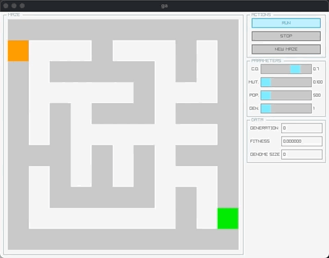

# ga

exploring the use of genetic algorithms to solve a 2d maze.



## description

this project uses a genetic algorithm to navigate through a 2d maze. the maze is generated at runtime, and the genetic algorithm is applied to find the optimal path. the project uses the raylib library for the visual representation of the maze and the gui.

if you're interested in learning more about the genetic algorithm, here's a brief explanation:

- initially, the genetic algorithm creates a population of random genomes. a genome is a sequence of directions (up, right, down, left) that represents a path through the maze.
- the fitness of each genome is evaluated based on how close it gets to the exit of the maze.
- two parents are selected for reproduction from the fittest portion of the population.
- a child is produced from the two parents, with a chance of crossover. if a crossover occurs, the child inherits a part of the path from each parent.
- the child is then subjected to mutation with a certain probability. this mutation either alters some directions in the child's path or inserts new directions at random positions.
- these steps are repeated until a new generation is created from the parent generation.
- the algorithm continues from generation to generation until a genome reaches the maximum fitness of 1.

please note: the current implementation of the genetic algorithm is quite basic and not optimized. solving the maze, particularly larger ones, may take some time and may even fail. i plan to work on these aspects as i learn more about the subject.

## build and run

building the project requires `cmake`.

```bash
cmake -D CMAKE_BUILD_TYPE=Debug -S . -B build/Debug
cmake --build build/Debug
./build/Debug/ga
```

## configuration

project parameters can be adjusted in the `parameters.toml` file.

## sources

the following resources helped me a lot:

- https://blog.gamedev.tv/procedural-generation-of-mazes-in-unreal-engine-part-i
- https://github.com/fadcrep/the-best-artificial-intelligence-books/blob/master/books/AI%20Techniques%20for%20Game%20Programming.pdf
